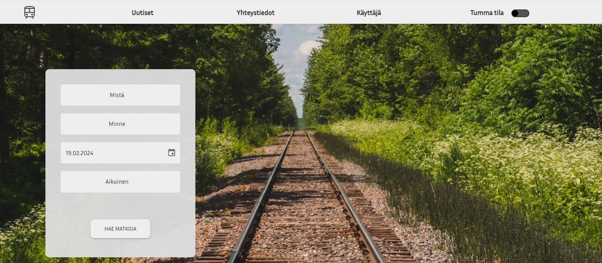
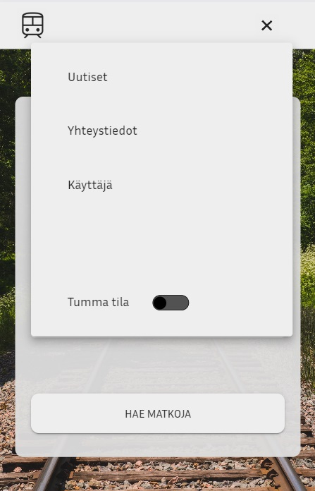

# Jäsenet

- Jani Meronen
- Arttu Knuutinen
- Saara Sairanen
- Tommy Niemi
- Aleksandra Babenko

# Käynnistäminen

Aja projektin juuressa:
```
docker compose up
```

Siirry selaimella osoitteeseen:
```
http://localhost:5197
```

# Entity Framework Core

Polku jossa kommennot suoritetaan:
```
C:\Users\Buutti\source\repos\Zuge
```

Add Migration
```
"C:\Program Files\dotnet\dotnet.exe" ef migrations add --project src\Zuge.Infrastructure\Zuge.Infrastructure.csproj --startup-project src\Zuge.UI\Zuge.UI.Server\Zuge.UI.Server.csproj --context Zuge.Infrastructure.Persistence.ZugeContext --configuration Debug Initial --output-dir Persistence/Migrations
```

Remove Last Migration
```
"C:\Program Files\dotnet\dotnet.exe" ef migrations remove --project src\Zuge.Infrastructure\Zuge.Infrastructure.csproj --startup-project src\Zuge.UI\Zuge.UI.Server\Zuge.UI.Server.csproj --context Zuge.Infrastructure.Persistence.ZugeContext --configuration Debug --force
```

Generate SQL Script
```
"C:\Program Files\dotnet\dotnet.exe" ef migrations script --project src\Zuge.Infrastructure\Zuge.Infrastructure.csproj --startup-project src\Zuge.UI\Zuge.UI.Server\Zuge.UI.Server.csproj --context Zuge.Infrastructure.Persistence.ZugeContext --configuration Debug 0 20231229165221_Initial --output script.sql
```

Update Database
```
"C:\Program Files\dotnet\dotnet.exe" ef database update --project src\Zuge.Infrastructure\Zuge.Infrastructure.csproj --startup-project src\Zuge.UI\Zuge.UI.Server\Zuge.UI.Server.csproj --context Zuge.Infrastructure.Persistence.ZugeContext --configuration Debug 20231229165221_Initial
```

Drop Database
```
"C:\Program Files\dotnet\dotnet.exe" ef database drop --project src\Zuge.Infrastructure\Zuge.Infrastructure.csproj --startup-project src\Zuge.UI\Zuge.UI.Server\Zuge.UI.Server.csproj --context Zuge.Infrastructure.Persistence.ZugeContext --configuration Debug --force
```

Scaffold DbContext
```
"C:\Program Files\dotnet\dotnet.exe" ef dbcontext scaffold --project src\Zuge.Infrastructure\Zuge.Infrastructure.csproj --startup-project src\Zuge.UI\Zuge.UI.Server\Zuge.UI.Server.csproj --configuration Debug Database=Data;Host=db;Password=postgres;Username=postgres Npgsql.EntityFrameworkCore.PostgreSQL --context ZugeDbContext --context-dir Context --force --output-dir Persistence/Migrations
```

# Frontend

### Tools, frameworks and libraries:

- vite (^5.0.8)
- react (^18.2.0)
- materialUI
- axios (^1.6.3)
- dayJS (^1.11.10)
- moment (^2.29.4)
- react-input-mask (^2.0.4)
- react-router-dom (^6.21.1)
- react-toastify (^10.0.4)


### Frontpage:


Frontpage on the computer


Frontpage on the phone, dropdown menu opened


### To test:

### Route search and payment:

#### Working cities:

- Keuruu
- Haapamäki
- Kolho
- Vilppula
- Juupajoki
- Orivesi Keskusta
- Orivesi
- Tampere

#### Working credit card num:

- 4242424242424242

### ! Use any email - there is no functionality to send the ticket to user !

### ToDo in the future:

- Send ticket to email
- Make routes for all cities
- Confirmation email to user email

### Login:

#### Opening the Login:
Clicking "Käyttäjä" opens the login form.

#### Try any email and password:
- Login only accepts emails that has "@" in the middle, special characters are not allowed, except "." and "_" and only letters a - z and A - Z are allowed. Email needs to have some characters before and after the "@" character. Domain part needs to have ".fi", ".com" or similar acceptable TLD.
- Passwords needs to have 6 to 100 characters, atleast one small letter, capital letter, number and a special character.
- The fields doesn't accept unallowed characters.
- Clicking "Peruuta" or clicking outside login menu will close the menu and empty the text fields.

#### Clicking "Rekisteröidy":
Clicking "Rekisteröidy" opens the register form.


### Register:

Register can be reached from login form (read Login).

#### Inputs:
- Email field accepts emails that has "@" in the middle, special characters are not allowed, except "." and "_" and only letters a - z and A - Z are allowed. Email needs to have some characters before and after the "@" character. Domain part needs to have ".fi", ".com" or similar acceptable TLD.
- Passwords needs to have 6 to 100 characters, atleast one small letter, capital letter, number and a special character.
- Passwords needs to match.
- The email and password fields doesn't accept unallowed characters.
- Name fields has to be 1 to 100 characters long, accepts only small and capital letters from a to ö and A to Ö, spaces and "-", other special characters and numbers are not allowed.
- Phone number only accepts numbers and needs to be 10 to 15 characters long. Country code or spaces are not allowed.
- All fields must have an acceptable value to register.
- Navigating to other pages will empty the text fields.


If none of the fields are red and the email is not already in the database, then clicking registration results in a successful registration. The user data is saved to the database and the user sees the registration successful -page. 

Clicking "Etusivulle" navigates to the front page on both registration form and registration successful -page.


